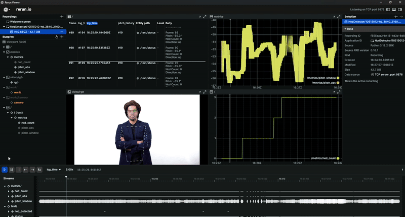

# Nod Detector 👋

A Python package for detecting nodding behavior in videos using MediaPipe. This tool analyzes head movements and identifies nodding patterns by tracking 3D face and pose landmarks in video files.



## 🚀 Installation

### Prerequisites
- Python 3.8 or higher
- MediaPipe (automatically installed via requirements.txt)
- Rerun (automatically installed via requirements.txt)

### Setup
```bash
# Clone the repository
git clone https://github.com/kkaytekin/nod_detector.git
cd nod_detector

# Create and activate a virtual environment (recommended)
python -m venv venv
.\venv\Scripts\activate  # On Windows
# On Unix/macOS: source venv/bin/activate

# Install the package in development mode with all dependencies
pip install -e .

# For development, install with additional development dependencies
# pip install -e ".[dev]"
```

## 🎬 Quick Start

### Using Python (Local Installation)
Process a video file with a single command:

```bash
# Show all available options
python -m nod_detector --help

# Process a video file with visualization
python -m nod_detector --input path/to/input_video.mp4 --visualize

# Save results to a specific directory
python -m nod_detector --input path/to/input_video.mp4 --output_dir results/
```

### 🐳 Using Docker

Docker provides a consistent environment that works across all platforms, ensuring the application runs the same way everywhere.

#### Prerequisites
- [Docker Desktop](https://www.docker.com/products/docker-desktop/) installed and running
- At least 4GB of RAM allocated to Docker (recommended)

#### Quick Start

1. **Build the Docker image** (only needed once or after code changes):
   ```bash
   docker compose build
   ```

2. **Process a video file**:
   ```bash
   # Copy your video to the input directory
   cp path/to/your/video.mp4 data/input/

   # Process the video with visualization
   docker compose run --rm nod-detector python -m nod_detector /data/input/video.mp4 -o /data/output/result.mp4 -v
   ```

   The processed video will be saved to `data/output/` on your host machine.

#### Common Commands

- **View help**:
  ```bash
  docker compose run --rm nod-detector python -m nod_detector --help
  ```

- **Process a video** (replace placeholders as needed):
  ```bash
  docker compose run --rm nod-detector python -m nod_detector \
    /data/input/input.mp4 \
    -o /data/output/result.mp4 \
    -v  # Enable visualization
  ```

- **Debug mode** (process only first 10 frames):
  ```bash
  docker compose run --rm nod-detector python -m nod_detector /data/input/input.mp4 -d
  ```

#### Notes
- The `data/input` and `data/output` directories are mounted as volumes, so files persist between container runs
- The container includes all necessary system dependencies for MediaPipe and OpenCV
- Use `--rm` flag to automatically clean up the container after it exits

### Expected Output
- Processed video file with visualizations (`output_video.mp4`)
- Interactive visualization using rerun.io (when `--visualize` flag is used)
- Console output showing processing statistics
- JSON files with detailed nod detection data (see [Output Data Structure](#output-data-structure) below)

## 📊 Output Data Structure

The nod detector generates individual JSON files for each processed frame along with a processed video file. The output directory structure is as follows:

```
output/
├── <input_video_name>_processed.mp4  # Processed video with visualizations
├── frame_000000.json                 # Frame 0 data
├── frame_000001.json                 # Frame 1 data
├── frame_000002.json                 # Frame 2 data
└── ...                              # And so on for each frame
```

### Frame Data Format

Each `frame_XXXXXX.json` file contains the following structure:

```json
{
  "frame_number": 0,                    // Frame number (0-based index)
  "timestamp": 0.0,                     // Timestamp in seconds
  "detections": [],                      // List of detections (if any)
  "head_pose": {                        // Head pose information
    "pitch": -51.42551400204901,        // Head pitch angle in degrees
    "yaw": 0.0,                         // Head yaw angle in degrees
    "roll": 0.0                         // Head roll angle in degrees
  },
  "pose_landmarks": {                  // 3D pose landmarks
    "0": {                              // Landmark ID (0-32 for body pose)
      "x": 0.4661392569541931,         // X coordinate (normalized)
      "y": 0.28261396288871765,        // Y coordinate (normalized)
      "z": -0.39765465259552,          // Z coordinate (normalized)
      "visibility": 0.990135908126831   // Visibility score [0, 1]
    },
    // ... more landmarks (0-32 for body pose)
  },
  "face_landmarks": {                  // 3D face landmarks (if detected)
    "0": {                             // Landmark ID (0-467 for face)
      "x": 0.5,                        // X coordinate (normalized)
      "y": 0.3,                        // Y coordinate (normalized)
      "z": -0.4,                       // Z coordinate (normalized)
      "visibility": 0.99               // Visibility score [0, 1]
    },
    // ... more face landmarks (0-467)
  },
  "nod_detected": false                // Whether a nod was detected in this frame
}
```

### Processed Video

The `<input_video_name>_processed.mp4` file contains the original video with the following visualizations overlaid:
- 3D pose landmarks (body keypoints)
- Face mesh (if face detection is enabled)
- TODO: Head pose axes showing orientation
- TODO: Nod detection indicators when a nod is detected

### Output Directory Contents

- **`frame_XXXXXX.json` files**: Individual JSON files for each frame containing:
  - Frame metadata (number, timestamp)
  - Head pose angles (pitch, yaw, roll)
  - 3D pose landmarks (body keypoints)
  - 3D face landmarks (if detected)
  - Nod detection status

- **`<input_video_name>_processed.mp4`**: The processed video with visualizations overlaid

### Notes
- All coordinates are normalized to [0, 1] range where (0,0) is the top-left corner and (1,1) is the bottom-right corner of the frame
- Negative Z values indicate points that are closer to the camera
- Visibility scores indicate the confidence of each landmark detection [0, 1]
- Head pose angles are in degrees, where:
  - Positive pitch: Looking up
  - Negative pitch: Looking down
  - Positive yaw: Turning right
  - Negative yaw: Turning left
  - Positive roll: Tilt right
  - Negative roll: Tilt left

## 📁 Project Structure
```
nod_detector/
├── src/
│   └── nod_detector/     # Main package
│       ├── pipeline/     # Video processing pipeline
│       │   └── video_processing_pipeline.py  # Main processing logic
│       ├── mediapipe_components.py  # MediaPipe integration
│       ├── nod_detection.py  # Nod detection algorithm
│       ├── output_utils.py   # Output handling and visualization
│       ├── main.py       # Command-line interface
│       └── __init__.py   # Package definition
├── tests/                # Test suite
│   ├── unit/            # Unit tests
│   ├── integration/     # Integration tests
│   └── data/            # Test video files
├── examples/            # Example scripts
├── Dockerfile           # Docker configuration
├── requirements.txt     # Python dependencies
├── setup.py            # Package configuration
└── pyproject.toml      # Build system configuration
```

## 🔍 Features

- **3D Face Landmark Detection**: Tracks 478 facial landmarks in 3D space
- **Pose Estimation**: Detects 33 pose landmarks for full body tracking
- **Head Pose Estimation**: Calculates pitch, yaw, and roll angles of the head
- **Real-time Visualization**: Visualizes landmarks and head pose in real-time
- **JSON Export**: Saves detection results in a structured JSON format
- **Modular Design**: Easy to extend with custom detection algorithms

## 🔍 Assumptions and Limitations
- The input video should contain clear frontal or near-frontal views of faces
- Lighting conditions should be sufficient for face detection
- The subject's head should be visible for most of the video duration
- Optimal detection occurs when the subject is within 1-2 meters from the camera
- The system works best with videos that have a minimum resolution of 640x480
- Frame rates between 24-60 FPS are recommended for best results
- Multiple faces in the frame may affect detection accuracy
- Performance may vary with different lighting conditions and video qualities


## 🎥 Visualization with Rerun

The nod detector supports interactive visualization using [Rerun](https://rerun.io/), a visualization tool for computer vision and robotics. When enabled with the `--visualize` flag, the pipeline will launch a Rerun viewer that shows:

- The input video stream

### Using the Rerun Viewer

1. The Rerun viewer will open automatically when you run the detector with the `--visualize` flag.
2. Use the timeline at the bottom to scrub through frames.
3. Toggle different visualizations using the right sidebar.
4. The 3D view shows the estimated fully body and head pose of the subject, projected onto the input video stream.


## 📚 Documentation

Comprehensive documentation is available on [GitHub Pages](https://kkaytekin.github.io/nod_detector/). The documentation includes:

- Installation and setup instructions
- Usage examples and API reference
- Development guidelines
- Troubleshooting
- and more!

### Building Documentation Locally

To build the documentation locally:

```bash
# Install documentation dependencies
pip install -e ".[docs]"

# Build the documentation
cd docs
make html

# Open the built documentation in your browser
start _build/html/index.html  # On Windows
# On macOS: open _build/html/index.html
# On Linux: xdg-open _build/html/index.html
```


## 🤝 Contributing

### For Users
Found a bug or have a feature request? Please open an issue on our [GitHub Issues](https://github.com/kkaytekin/nod_detector/issues) page.

### Open Tasks
- [ ] Improve nod detection algorithm, also consider yaw and roll angles for better nod detection
- [ ] Implement light-weight version with downscaled video resolution
- [ ] Review documentation
- [ ] Clear code base of unused code and unit tests

### For Developers
1. Fork the repository
2. Create a feature branch (`git checkout -b feature/amazing-feature`)
3. Set up pre-commit hooks (see below)
4. Make your changes and commit them
5. Push to the branch (`git push origin feature/amazing-feature`)
6. Open a Pull Request

### Development Setup
```bash
# Install the package in development mode with all dependencies
pip install -e ".[dev]"

# Install pre-commit hooks (runs automatically on git commit)
pre-commit install

# Run tests
pytest

# Format code with black
black .

# Check code style with flake8
flake8  # Configured to exclude .venv and other common directories

# Run type checking with mypy
mypy src/
```

### 🔩 Pre-commit Hooks
This project uses pre-commit to run several code quality checks before each commit. The following hooks are configured:

- **Black**: Code formatting
- **isort**: Import sorting
- **Flake8**: Linting
- **Mypy**: Static type checking
- **Pre-commit hooks**: Various checks for common issues

These hooks run automatically when you make a commit. If any checks fail, the commit will be aborted and you'll need to fix the issues before committing.

### 🚀 Development Workflow
1. Write tests for new features or bug fixes
2. Implement the feature/fix to make the tests pass
3. Run tests and fix any issues (`pytest`)
4. Format your code (`black .`)
5. Check for code style issues (`flake8`)
6. Run type checking (`mypy src/`)
7. Stage and commit your changes - pre-commit hooks will run automatically
8. Push to your fork and open a pull request

### 🧪 Testing

The project includes a comprehensive test suite to ensure reliability and maintainability.

#### Running Tests

```bash
# Run all tests
pytest

# Run only unit tests
pytest tests/unit/

# Run only integration tests
pytest tests/integration/ -m integration

# Run tests with coverage report
pytest --cov=src/nod_detector --cov-report=term-missing
```

#### Test Structure
- `tests/unit/`: Unit tests for individual components
- `tests/integration/`: Integration tests that verify the system as a whole
- `tests/data/`: Test data and fixtures

### Configuration Files
- `.flake8`: Flake8 configuration (excludes, line length, etc.)
- `pyproject.toml`: Configuration for various tools (black, isort, mypy, pytest)
- `.pre-commit-config.yaml`: Pre-commit hooks configuration

## 📄 License
This project is licensed under the MIT License - see the [LICENSE](LICENSE) file for details.

## 🙏 Acknowledgments
- Built with [MediaPipe](https://mediapipe.dev/)
- Inspired by research in computer vision and behavior analysis
