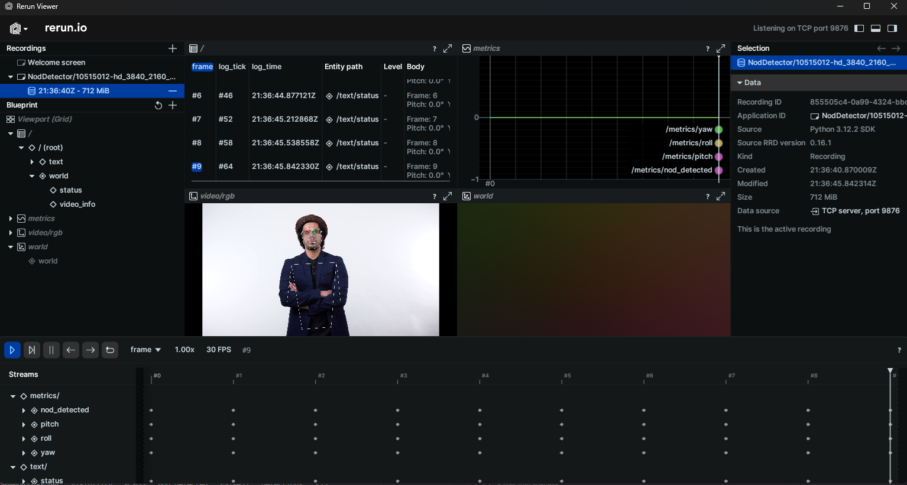

# Nod Detector 👋

A Python package for detecting nodding behavior in videos using MediaPipe. This tool analyzes head movements and identifies nodding patterns by tracking 3D face and pose landmarks in video files.



## 🚀 Installation

### Prerequisites
- Python 3.8 or higher
- MediaPipe (automatically installed via requirements.txt)
- Rerun (automatically installed via requirements.txt)

### Setup
```bash
# Clone the repository
git clone https://github.com/kkaytekin/nod_detector.git
cd nod_detector

# Create and activate a virtual environment (recommended)
python -m venv venv
.\venv\Scripts\activate  # On Windows
# On Unix/macOS: source venv/bin/activate

# Install the package in development mode with all dependencies
pip install -e .

# For development, install with additional development dependencies
# pip install -e ".[dev]"
```

## 🎬 Quick Start

Process a video file with a single command:
```bash
# Install dependencies
pip install -r requirements.txt

# Show all available options
python -m nod_detector --help

# Process a video file with visualization
python -m nod_detector --input path/to/input_video.mp4 --visualize

# Save results to JSON
python -m nod_detector --input path/to/input_video.mp4 --output results.json
```

### Expected Output
- Processed video file with visualizations
- Interactive visualization using rerun.io (when --visualize flag is used)
- Console output showing processing statistics
- (Future) JSON file with detailed nod detection data

## 📁 Project Structure
```
nod_detector/
├── src/
│   └── nod_detector/     # Main package
│       ├── pipeline/     # Video processing pipeline
│       ├── mediapipe_components.py  # MediaPipe integration
│       ├── main.py       # Command-line interface
│       └── __init__.py   # Package definition
├── tests/                # Test suite
│   ├── unit/            # Unit tests
│   └── integration/      # Integration tests
└── examples/             # Example scripts
```

## 🔍 Features

- **3D Face Landmark Detection**: Tracks 478 facial landmarks in 3D space
- **Pose Estimation**: Detects 33 pose landmarks for full body tracking
- **Head Pose Estimation**: Calculates pitch, yaw, and roll angles of the head
- **Real-time Visualization**: Visualizes landmarks and head pose in real-time
- **JSON Export**: Saves detection results in a structured JSON format
- **Modular Design**: Easy to extend with custom detection algorithms

## 🔍 Assumptions
- The input video contains clear frontal or near-frontal views of faces
- Lighting conditions are sufficient for face detection
- The subject's head is visible for most of the video duration
- The subject is within 1-2 meters from the camera for optimal detection

## 🤝 Contributing

### For Users
Found a bug or have a feature request? Please open an issue on our [GitHub Issues](https://github.com/kkaytekin/nod_detector/issues) page.

### For Developers
1. Fork the repository
2. Create a feature branch (`git checkout -b feature/amazing-feature`)
3. Set up pre-commit hooks (see below)
4. Make your changes and commit them
5. Push to the branch (`git push origin feature/amazing-feature`)
6. Open a Pull Request

### Development Setup
```bash
# Install the package in development mode with all dependencies
pip install -e ".[dev]"

# Install pre-commit hooks (runs automatically on git commit)
pre-commit install

# Run tests
pytest

# Format code with black
black .

# Check code style with flake8
flake8  # Configured to exclude .venv and other common directories

# Run type checking with mypy
mypy src/
```

### 🔩 Pre-commit Hooks
This project uses pre-commit to run several code quality checks before each commit. The following hooks are configured:

- **Black**: Code formatting
- **isort**: Import sorting
- **Flake8**: Linting
- **Mypy**: Static type checking
- **Pre-commit hooks**: Various checks for common issues

These hooks run automatically when you make a commit. If any checks fail, the commit will be aborted and you'll need to fix the issues before committing.

### 🚀 Development Workflow
1. Write tests for new features or bug fixes
2. Implement the feature/fix to make the tests pass
3. Run tests and fix any issues (`pytest`)
4. Format your code (`black .`)
5. Check for code style issues (`flake8`)
6. Run type checking (`mypy src/`)
7. Stage and commit your changes - pre-commit hooks will run automatically
8. Push to your fork and open a pull request

### 🧪 Testing

The project includes a comprehensive test suite to ensure reliability and maintainability.

#### Running Tests

```bash
# Run all tests
pytest

# Run only unit tests
pytest tests/unit/

# Run only integration tests
pytest tests/integration/ -m integration

# Run tests with coverage report
pytest --cov=src/nod_detector --cov-report=term-missing
```

#### Test Structure
- `tests/unit/`: Unit tests for individual components
- `tests/integration/`: Integration tests that verify the system as a whole
- `tests/data/`: Test data and fixtures

### 🎥 Visualization with Rerun

The nod detector supports interactive visualization using [Rerun](https://rerun.io/), a visualization tool for computer vision and robotics. When enabled with the `--visualize` flag, the pipeline will launch a Rerun viewer that shows:

- The input video stream
### TODO: Future
- Detected face landmarks
- Head pose estimation (pitch, yaw, roll)
- Nod detection status
- Bounding boxes around detected faces

### Using the Rerun Viewer

1. The Rerun viewer will open automatically when you run the detector with the `--visualize` flag.
2. Use the timeline at the bottom to scrub through frames.
3. Toggle different visualizations using the right sidebar.
4. The 3D view shows the estimated head pose in 3D space.

### Configuration Files
- `.flake8`: Flake8 configuration (excludes, line length, etc.)
- `pyproject.toml`: Configuration for various tools (black, isort, mypy, pytest)
- `.pre-commit-config.yaml`: Pre-commit hooks configuration

## 📄 License
This project is licensed under the MIT License - see the [LICENSE](LICENSE) file for details.

## 🙏 Acknowledgments
- Built with [MediaPipe](https://mediapipe.dev/)
- Inspired by research in computer vision and behavior analysis
